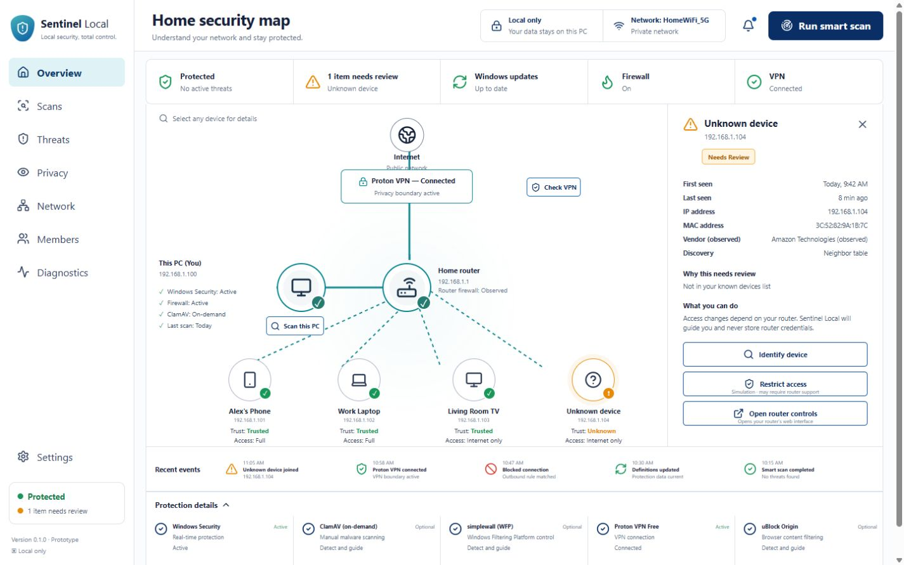

# Sentinel Local

Sentinel Local is a local-first Windows 11 security center prototype. It combines a device-first home-network map with Windows protection status, explicit malware scans, privacy controls, network-member review, and evidence-based diagnostics.

The application uses a React and TypeScript interface inside Tauri v2, with narrowly scoped Rust commands for local Windows and network observations. It does not run a localhost web server in packaged builds.



## Current capabilities

- Read-only Windows Security, firewall, adapter, VPN-like adapter, gateway, and neighbor observations
- Microsoft Defender quick and full scan launch after explicit user action
- ClamAV on-demand file scanning when an official installation is detected
- Detection and official guidance for ClamAV, simplewall, Proton VPN Free, uBlock Origin, Wireshark, and Nmap
- Local network-member labels and metadata-only SQLite storage
- Private-gateway validation before opening router controls
- Responsive, keyboard-accessible security map and device inspector

## Safety boundaries

- Quarantine, deletion, firewall changes, network resets, and member restrictions are simulations in this prototype.
- Router changes remain in the router's own interface. Sentinel Local never stores router or VPN credentials.
- Device vendors and types are observations, not proof of a person's identity.
- Sentinel Local does not claim to make a user anonymous.
- There is no telemetry, advertising, subscription, paid recommendation, affiliate link, or automatic tool installation.

## Technology

- Tauri v2 and Rust
- React 19 and TypeScript
- Vite
- SQLite through `rusqlite`
- Vitest and Testing Library

## Development

Requirements:

- Windows 11 x64
- Node.js 20 or newer
- Current stable Rust toolchain
- Microsoft WebView2
- Tauri's Windows build prerequisites

Install dependencies and run the web interface:

```powershell
npm install
npm run dev
```

Run the Tauri application:

```powershell
npm run tauri -- dev
```

Run verification:

```powershell
npm run lint
npm test
npm run build
Set-Location src-tauri
cargo test
```

Build the Windows installer:

```powershell
npm run tauri -- build
```

## Security architecture

- Packaged UI assets only, with a restrictive Content Security Policy
- Named and typed Tauri commands rather than a generic shell bridge
- Fixed Windows queries and allowlisted external destinations
- Standard-user startup with no permanent elevation
- Private-address and detected-gateway validation for router handoff
- User-profile path validation for ClamAV scan targets
- Metadata-only local logging by default

See [SECURITY.md](SECURITY.md) for responsible disclosure and supported-version information.

## Project status

Sentinel Local is an early prototype, not a replacement for Microsoft Defender, a managed endpoint-security platform, or professional incident response. The repository intentionally has no open-source license yet; all rights remain reserved until a license is selected.

